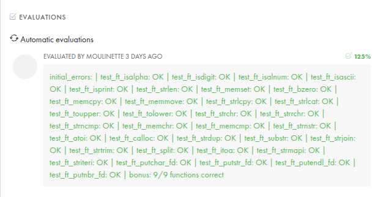

# Libft Project

A fundamental project at 42 School where we recreate standard C library functions from scratch. This library will be used as a foundation for future C programming projects at 42.

## 📚 About

The Libft project requires us to recreate various standard C library functions, helping us understand how these functions work behind the scenes. The library includes string manipulation, memory management, character type checking, linked list operations, and more.

### 🛠️ Functions Implemented

#### Libc Functions
- **Memory**: `memset`, `bzero`, `memcpy`, `memccpy`, `memmove`, `memchr`, `memcmp`
- **String**: `strlen`, `strlcpy`, `strlcat`, `strchr`, `strrchr`, `strncmp`, `strnstr`, `strdup`
- **Type**: `isalpha`, `isdigit`, `isalnum`, `isascii`, `isprint`, `toupper`, `tolower`
- **Stdlib**: `atoi`, `calloc`

#### Additional Functions
- **String Manipulation**: `substr`, `strjoin`, `strtrim`, `split`, `itoa`, `strmapi`, `striteri`
- **File Descriptors**: `putchar_fd`, `putstr_fd`, `putendl_fd`, `putnbr_fd`

#### Bonus Functions (Linked Lists)
- **List Operations**: `lstnew`, `lstadd_front`, `lstsize`, `lstlast`, `lstadd_back`, `lstdelone`, `lstclear`, `lstiter`, `lstmap`

### 🎓 What I Learned

- Deep understanding of C memory management
- Data structures implementation (Linked Lists)
- Advanced debugging techniques with GDB
- Project organization and modular programming
- Documentation reading and interpretation (RTFM)
- Problem-solving and algorithmic thinking

### ⭐ Evaluation

</img>

## 🚀 Usage

```bash
# Clone the repository
git clone https://github.com/thawansilva/libft_project.git
cd libft_project

# Compile the library
make        # Mandatory functions
make bonus  # Include bonus functions

# Clean generated files
make clean  # Remove object files
make fclean # Remove object files and library
make re     # Recompile the library
```